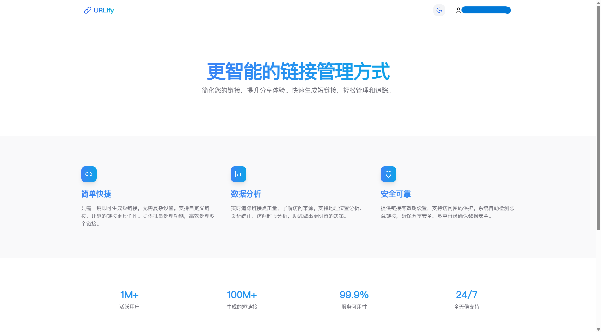
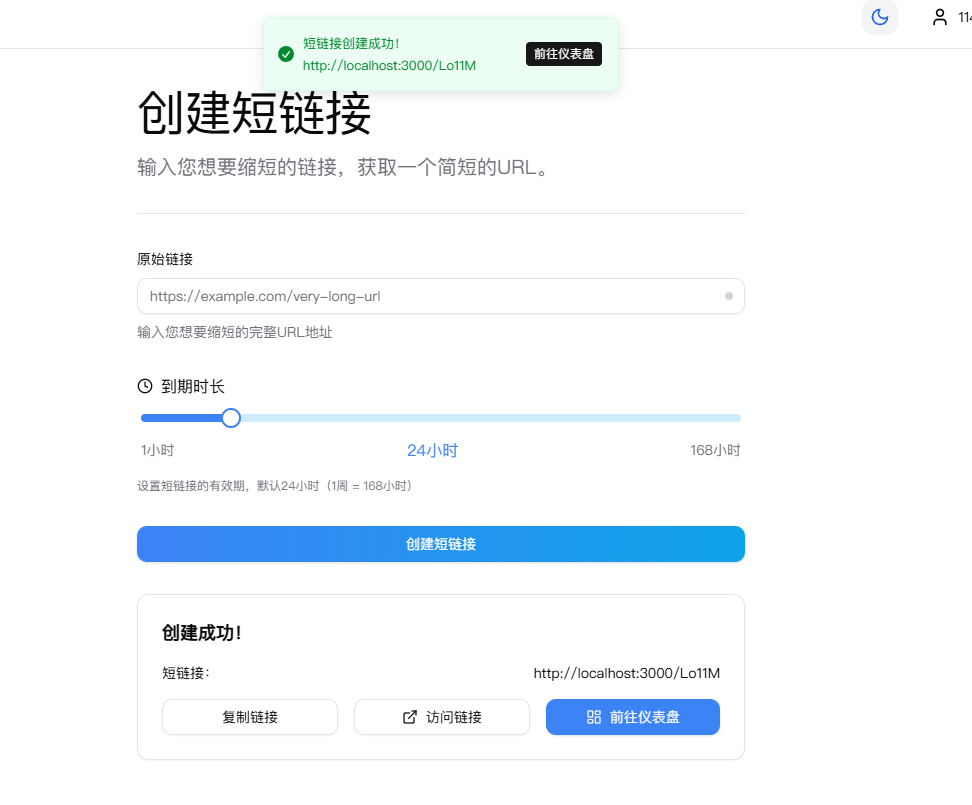
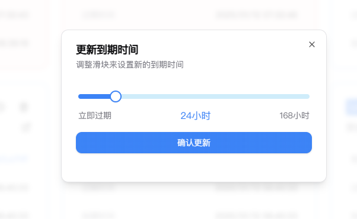
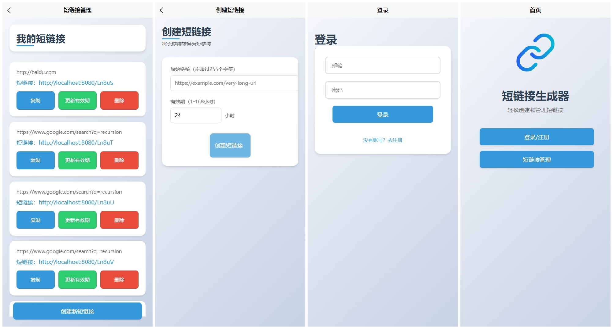
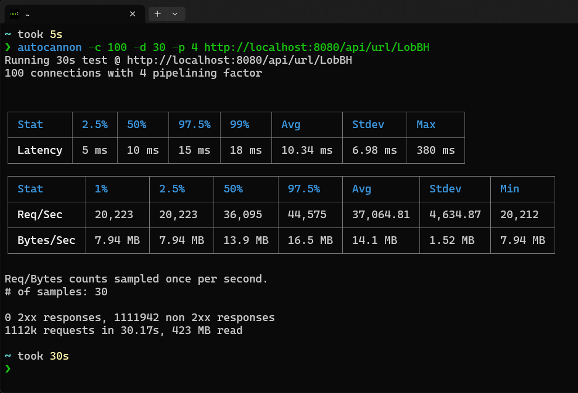

# URLify 短链接生成与管理平台

## 项目概述

短链接生成器是一个用于轻松创建和管理短链接的 Web 应用。用户可以将长链接转换为简短、易于分享的链接，并可以对这些短链接进行管理和更新。

## 主要功能

1. **短链接生成**：用户可以输入一个长链接，系统将自动生成一个简短的短链接。
2. **短链接管理**：用户可以查看、更新或删除已生成的短链接。
3. **用户注册与登录**：支持用户注册新账号或使用已有账号登录。
4. **有效期管理**：用户可以设置短链接的有效期（1-168 小时），并进行更新。

## 项目展示效果

### 首页



### 登录界面


### 创建短链接界面



### 更新短链接到期时间界面



### 移动端兼容性


### 小程序界面



### 性能测试

通过 Docker Compose 部署 Urlify 服务，对服务进行了性能测试，结果如下：

-   写操作能够达到 1000+ QPS。
-   在命中本地缓存的单一测试场景下，极限读取性能能够达到 40,000 QPS，p99 延迟在 18ms 内。



## 工作流程

1. 用户访问首页，可以选择登录或注册。
2. 登录后，用户可以进入短链接管理页面，查看和操作自己的短链接。
3. 用户可以在创建短链接页面输入长链接，生成短链接，并设置短链接的有效期。
4. 用户可以更新短链接的有效期，或删除不再需要的短链接。

## Todo

-   [x] 过期处理（redis 中可以存储过期时间，或者 redis 中设置到期时间少于数据库过期时间） - 缓存数据库一致性
-   [x] 添加布隆过滤器减少缓存击穿情况的发生
-   [x] 容器化部署
-   [ ] 使用布谷鸟过滤器替换布隆过滤器（布谷鸟过滤器支持删除操作）
-   [ ] 修改短链接到期时间的缓存数据库一致性问题（如延迟双删、给缓存加锁）
-   [ ] 优化仪表盘分页查询方式，防止深度分页导致性能问题
-   [ ] 优雅的退出
-   [ ] 链接访问统计
-   [ ] 优化连接关闭（返回 clean 接口，类似于 `contextWithCancel`，可参考 [Apache-Answer](https://github.com/apache/incubator-answer) ）
-   [ ] 连接重试（如数据库），而非 panic（可参考 [Apache-Answer](https://github.com/apache/incubator-answer) ）
-   [ ] 读写分离（参考 [beihai0xff/turl](https://github.com/beihai0xff/turl) ）
-   [ ] token 有效期缩短，添加自动续期与 token 黑名单（处理登出与改密）
-   [ ] 服务限流
-   [ ] 更好的集成测试与单元测试，可以对于有依赖的内容可以借助 [testcontainers](https://github.com/testcontainers/testcontainers-go)
-   [ ] 可观测性监控

待考虑项：

-   [ ] 更好的 log 打印（参考 `internal/module/user/register.go`）
-   [ ] 批量生成短链接功能（如提交文件）
-   [ ] 链接访问数据导出
-   [ ] ~~相同 url 可以幂等~~
-   [ ] ~~过期短链的处理（如轮询扫描全表，删除过期的）~~

## 目录设计说明

```text
├── cmd
│   ├── gen
│   │   └── gen.go # 依赖 `internal/model` 用于生成 `internal/query` 代码
│   └── server
│       └── server.go
├── config # golang配置包
├── deploy # 部署任务相关
|-- main.go #程序入口
├── internal
│   ├── global # 为内部提供全局变量或函数
│   │   ├── database # 数据相关
│   │   |   ├── mysql
│   │   |   └── redis
│   │   ├── logger # 日志相关
│   │   ├── query # gorm.io/gen 生成的数据库相关操作
│   │   └── middleware # 中间件
│   ├── module # 模块（或controller），如短链模块
│   └── model # 数据库模型
├── pkg # 公共包，最多依赖 config
│   └── tools # 直接函数，如异常处理，判断等（不需要init的工具，防止初始化影响其他包）
```

## 使用

```shell
# todo: 主容器等待依赖完全启动
docker compose -f ./deploy/docker-compose.yaml -p urlshortener-net up
```

## 开发

### 前端

```shell
cd ./frontend
pnpm install
pnpm dev
```

### 后端

可查看 `scripts/scripts.nu`

```shell
# 启动后端服务器
go run main.go
```
