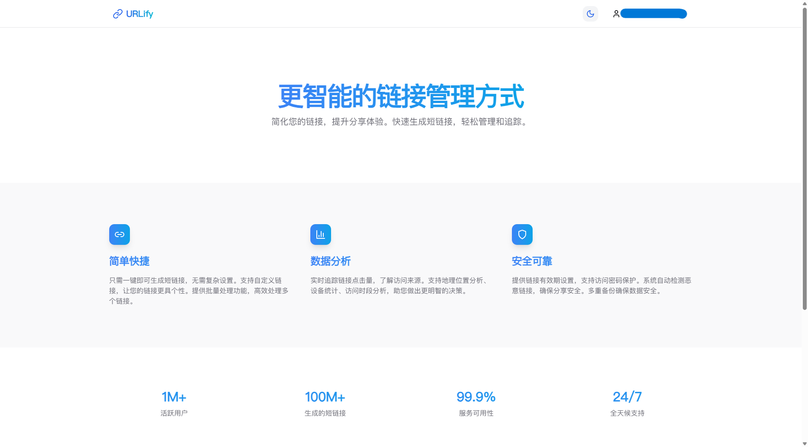
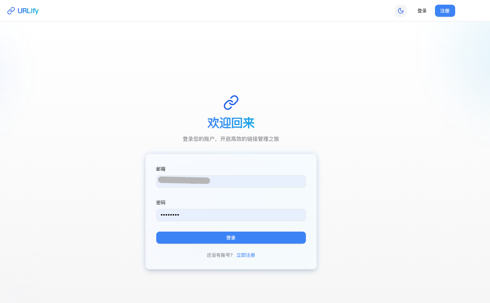
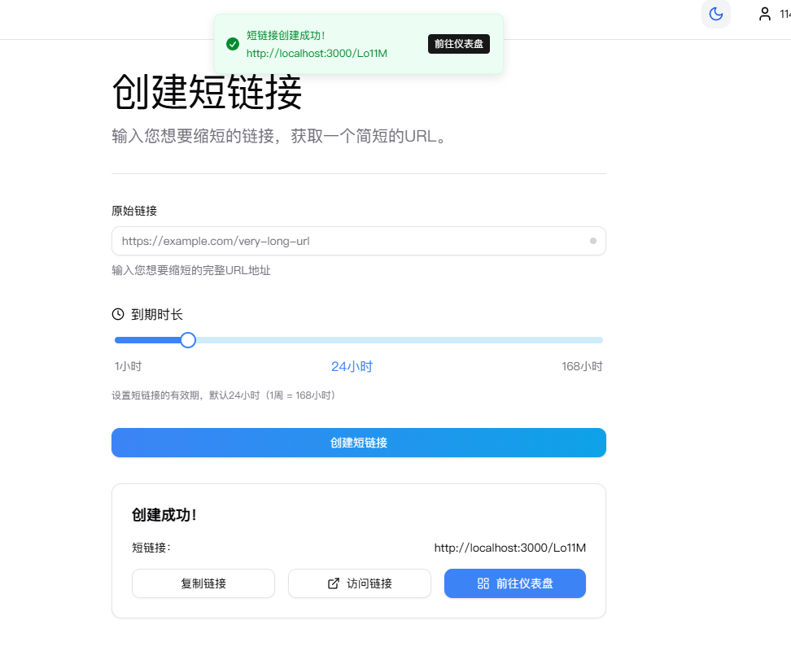
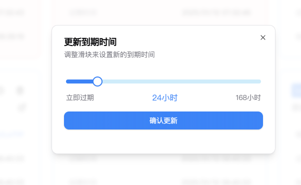
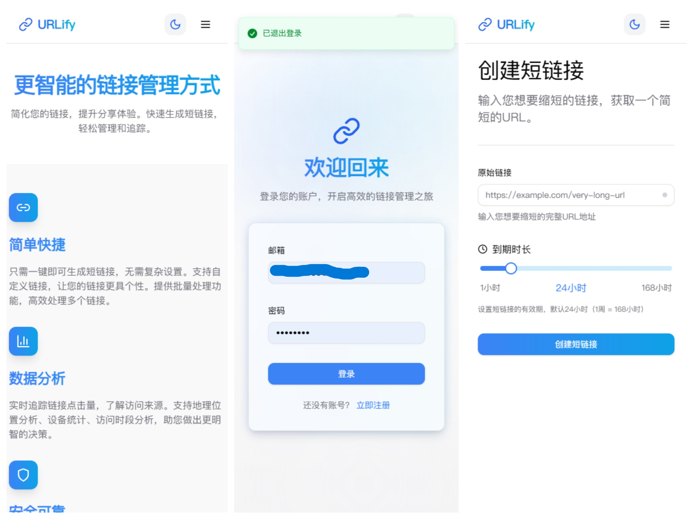
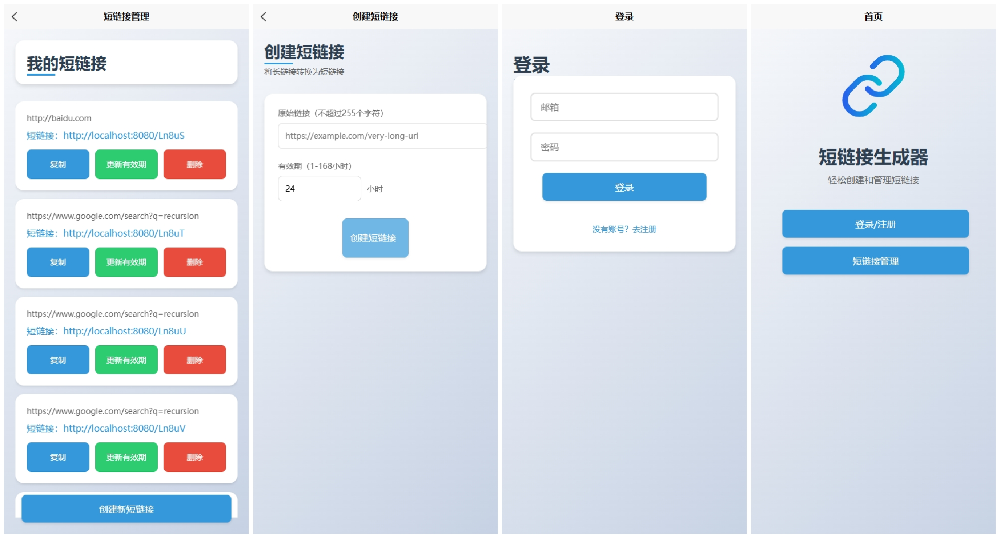
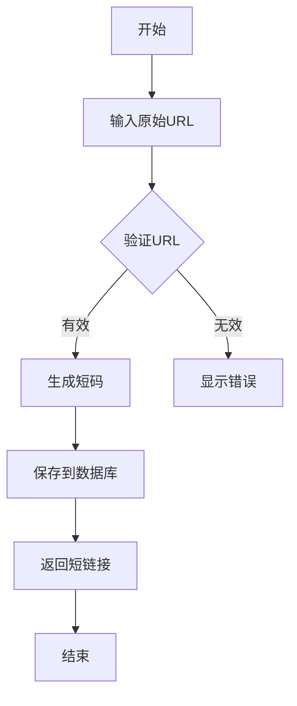
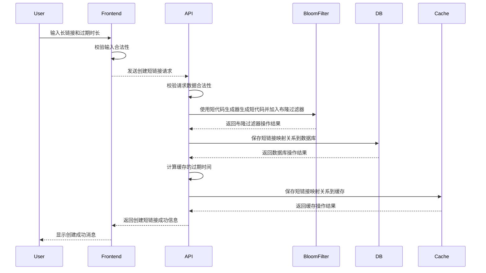
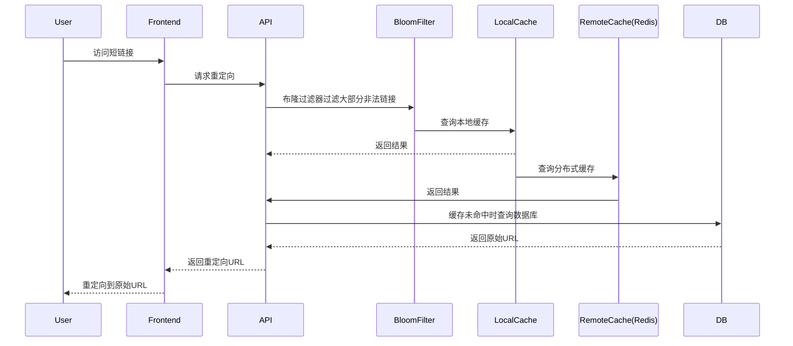
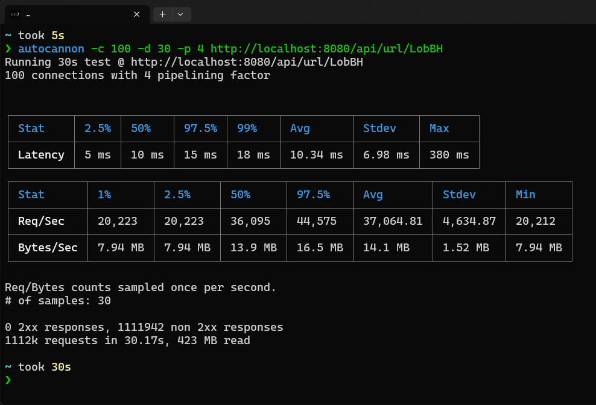

# URLify 短链接生成与管理平台

## 项目概述

本项目是一个短链接生成与管理平台，旨在为用户提供一个简便的方式来缩短长链接，并提供管理短链接的功能，如设置和更新短链接的有效期、删除不再需要的短链接等。后端使用 Go 语言开发，前端支持 Web 和小程序，并通过 Nginx 进行路由转发。

## 技术栈

- 后端: Golang
- 前端: Next.js（Web），UniApp（小程序）
- 数据库: MySQL
- 缓存: Redis
- 部署: Docker, Docker Compose
- 路由转发: Nginx

## 主要功能

1. **短链接生成**：用户可以输入一个长链接，系统将自动生成一个简短的短链接。
2. **短链接管理**：用户可以查看、更新或删除已生成的短链接。
3. **用户注册与登录**：支持用户注册新账号或使用已有账号登录。
4. **有效期管理**：用户可以设置短链接的有效期（1-168 小时），并进行更新。

## 项目展示效果

### 首页



### 登录界面



### 创建短链接界面



### 更新短链接到期时间界面



### 移动端兼容性



### 小程序界面



## 工作流程

1. 用户访问首页，可以选择登录或注册。
2. 登录后，用户可以进入短链接管理页面，查看和操作自己的短链接。
3. 用户可以在创建短链接页面输入长链接，生成短链接，并设置短链接的有效期。
4. 用户可以更新短链接的有效期，或删除不再需要的短链接。

### 动态模型

#### 活动图：短链接创建流程


```mermaid
flowchart TD
    Start[开始] --> Input[输入原始URL]
    Input --> Validate{验证URL}
    Validate -->|有效| Generate[生成短码]
    Validate -->|无效| Error[显示错误]
    Generate --> Save[保存到数据库]
    Save --> Return[返回短链接]
    Return --> End[结束]
```

#### 顺序图：短链接创建


```mermaid
sequenceDiagram
    participant User
    participant Frontend
    participant API
    participant BloomFilter
    participant DB
    participant Cache

    User->>Frontend: 输入长链接和过期时长
    Frontend->>Frontend: 校验输入合法性
    Frontend-->>API: 发送创建短链接请求
    API->>API: 校验请求数据合法性
    API->>BloomFilter: 使用短代码生成器生成短代码并加入布隆过滤器
    BloomFilter-->>API: 返回布隆过滤器操作结果
    API->>DB: 保存短链接映射关系到数据库
    DB-->>API: 返回数据库操作结果
    API->>API: 计算缓存的过期时间
    API->>Cache: 保存短链接映射关系到缓存
    Cache-->>API: 返回缓存操作结果
    API-->>Frontend: 返回创建短链接成功信息
    Frontend-->>User: 显示创建成功消息
```

1. 用户输入长链接以及过期时长;
2. 前端对用户的输入进行合法性校验;
3. 校验通过后会向服务端发起创建短链接请求;
4. 服务端接收到请求后，二次校验数据合法性;
5. 校验通过后会通过短代码生成器生成一个唯一的短代码，并加入到布隆过滤器中;
6. 服务端将短链接映射关系保存到数据库中;
7. 服务端计算缓存的过期时间，并将短链接映射关系保存到缓存中;
8. 服务端返回创建成功信息给客户端;

#### 顺序图：短链接重定向


```mermaid
sequenceDiagram
    participant User
    participant Frontend
    participant API
    participant BloomFilter
    participant LocalCache
    participant RemoteCache(Redis)
    participant DB

    User->>Frontend: 访问短链接
    Frontend->>API: 请求重定向
    API->>BloomFilter: 布隆过滤器过滤大部分非法链接
    BloomFilter->>LocalCache: 查询本地缓存
    LocalCache-->>API: 返回结果
    LocalCache->>RemoteCache(Redis):查询分布式缓存
    RemoteCache(Redis)->>API:返回结果
    API->>DB: 缓存未命中时查询数据库
    DB-->>API: 返回原始URL
    API-->>Frontend: 返回重定向URL
    Frontend-->>User: 重定向到原始URL
```

1. 用户访问短链接时，服务端接收到请求，会先通过布隆过滤器进行存在性非法过滤;
2. 将会优先从本地缓存中获取短链接-长链接映射关系，如果本地缓存中不存在，则从分布式缓存中获取，如果分布式缓存中不存在，则从数据库中获取；
3. 如果本地缓存不存在，分布式缓存中存在，则将接映射关系写入本地缓存中，以提高访问性能；如果缓存中不存在，数据库中存在，则将映射关系写入缓存中；
4. 如果数据库中也不存在，则返回 404 错误，表示短链接不存在，同时可以设置黑名单，对恶意访问进行限制；
5. 如果获取短链接成功，通过 302 临时重定向的方式，将用户重定向到原始的长链接；
6. 访问短链接成功后，可以统计短链接的访问次数，以便后续分析短链接的访问情况；

## 项目结构

```shell
├── cmd
│   ├── gen
│   │   └── gen.go # 依赖 `internal/model` 用于生成 `internal/query` 代码
│   └── server
│       └── server.go
├── config # Golang配置包
├── deploy # 部署相关文件
├── main.go #程序入口
├── internal
│   ├── global # 为内部提供全局变量或函数
│   │   ├── database # 数据相关
│   │   │   ├── mysql
│   │   │   └── redis
│   │   ├── logger # 日志相关
│   │   ├── query # gorm.io/gen 生成的数据库相关操作
│   │   └── middleware # 中间件
│   ├── module # 模块（或controller），如短链模块、用户模块等
│   └── model # 数据库模型
├── pkg # 公共包，最多依赖 config
│   └── tools # 直接函数，如异常处理，判断等（不需要init的工具，防止初始化影响其他包）
├── frontend # next.js 前端
└── uniapp # uniapp 小程序前端
```

## 功能实现

- 短链接生成：使用分布式 ID 生成器来保证短链接的唯一性。支持用户自定义短链接。
- 短链接访问：支持短链接的跳转，通过 Redis 缓存加速访问。
- 过期处理：通过 Redis 存储短链接的过期时间，定期检查并删除过期的短链接。
- 布隆过滤器：使用布隆过滤器减少缓存击穿的情况。
- 服务限流：通过中间件实现服务限流，防止服务器过载。
- 用户管理：支持用户认证与权限管理，保障数据安全。
- 容器化部署：支持 Docker 和 Docker Compose 进行镜像构建和容器部署。
- Nginx 部署：使用 Nginx 进行路由转发，提高性能和安全性。

## 部署

```shell
docker compose -f ./deploy/docker-compose.yaml -p urlshortener-net up
```

### 性能测试

通过 Docker Compose 部署 Urlify 服务，对服务进行了性能测试，结果如下：

- 写操作能够达到 1000+ QPS。
- 在命中本地缓存的单一测试场景下，极限读取性能能够达到 40,000 QPS，p99 延迟在 18ms 内。



## 致谢

感谢以下项目与文章的帮助与启发：

- [Apache-Answer](https://github.com/apache/incubator-answer)。
- [实现高并发短链接服务 - beihai blog](https://wingsxdu.com/posts/system-design/tiny-url/)

## 许可证

本项目采用[Apache 2.0 许可证](./LICENSE)。
